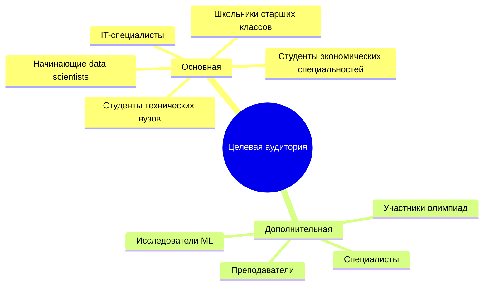
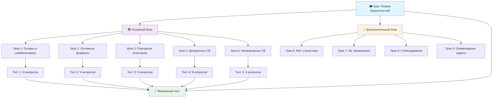
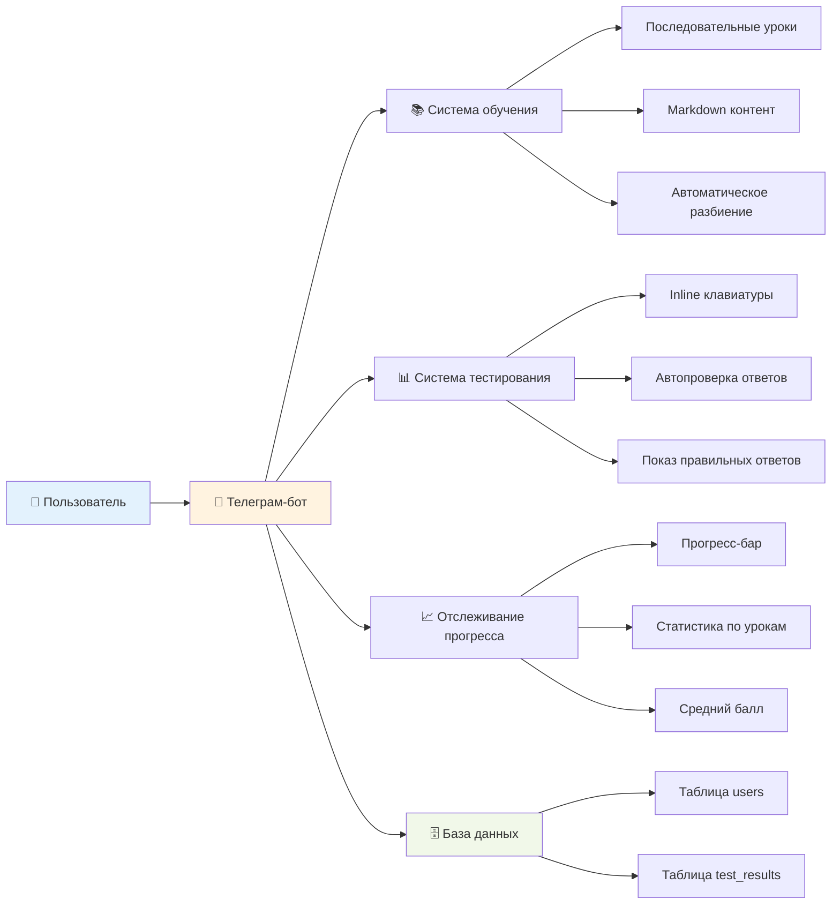
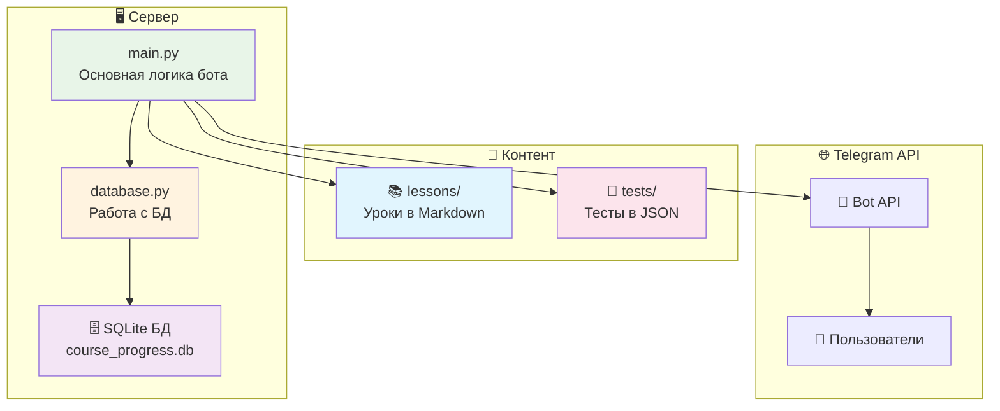
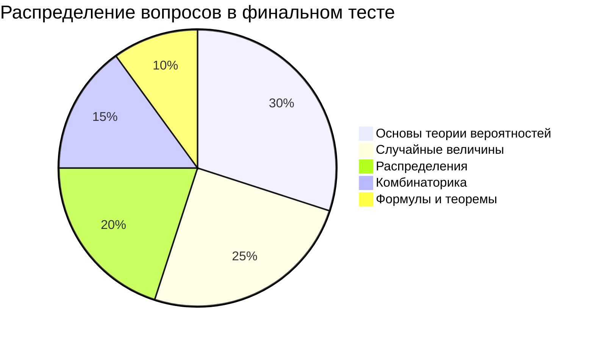
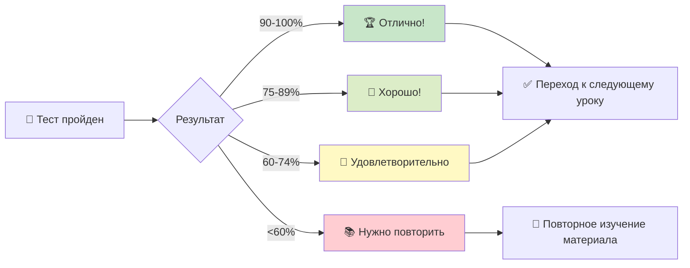
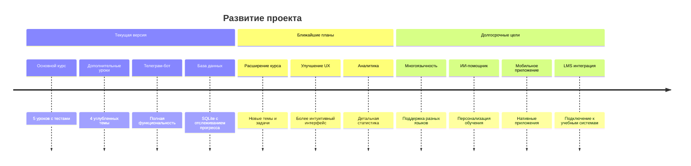

# 🎓 Презентация онлайн курса "Теория вероятностей и математическая статистика"
## Телеграм-бот для интерактивного обучения @pumpumpummda_bot

---

## 🎯 Целевая аудитория



### Основная аудитория:
- **Студенты технических вузов** (2-3 курс)
- **Студенты экономических специальностей**
- **Начинающие data scientists и аналитики**
- **IT-специалисты**, готовящиеся к собеседованиям
- **Школьники старших классов** с углубленным изучением математики

### Дополнительная аудитория:
- **Преподаватели** для использования в учебном процессе
- **Специалисты**, желающие освежить знания
- **Участники математических олимпиад**
- **Исследователи** в области машинного обучения

### Уровень подготовки:
- Базовые знания математики (алгебра, начала анализа)
- Понимание основ комбинаторики (желательно)
- Опыт работы с Telegram

---

## 🎯 Цель и задачи курса

### **Главная цель:**
Обеспечить качественное и доступное изучение основ теории вероятностей и математической статистики через интерактивную платформу Telegram

### **Основные задачи:**

#### 📚 Образовательные:
- Сформировать понимание основных понятий теории вероятностей
- Научить решать практические задачи на вероятность
- Освоить методы математической статистики
- Подготовить к применению знаний в профессиональной деятельности

#### 🛠 Практические:
- Развить навыки решения вероятностных задач
- Научить применять статистические методы
- Подготовить к собеседованиям в IT-сфере
- Сформировать базу для изучения машинного обучения

#### 💡 Развивающие:
- Развить логическое и аналитическое мышление
- Сформировать навыки работы с неопределенностью
- Научить интерпретировать статистические данные

---

## 📈 Планируемые результаты обучения

### После завершения курса студенты будут:

#### **Знать:**
- ✅ Основные понятия и определения теории вероятностей
- ✅ Классическое, геометрическое и статистическое определения вероятности
- ✅ Формулы комбинаторики и их применение
- ✅ Основные теоремы теории вероятностей
- ✅ Виды случайных величин и их характеристики
- ✅ Основные распределения вероятностей
- ✅ Методы математической статистики

#### **Уметь:**
- 🎯 Решать задачи на классическую вероятность
- 🎯 Применять формулы Бернулли, Пуассона, Муавра-Лапласа
- 🎯 Находить характеристики случайных величин
- 🎯 Работать с нормальным распределением
- 🎯 Проводить статистические тесты
- 🎯 Строить доверительные интервалы
- 🎯 Проверять статистические гипотезы

#### **Владеть:**
- 🔧 Методами решения вероятностных задач
- 🔧 Техниками статистического анализа
- 🔧 Навыками интерпретации результатов
- 🔧 Подходами к решению задач на собеседованиях

---

## 🏗 Структура курса



### **Основной блок (5 уроков с тестированием):**

#### 📖 **Урок 1:** Основы теории вероятностей и комбинаторики
- Основные понятия и определения
- Классическое определение вероятности
- Элементы комбинаторики
- **Тест:** 8 вопросов

#### 📖 **Урок 2:** Основные формулы теории вероятностей
- Операции над событиями
- Теоремы сложения и умножения
- Условная вероятность
- **Тест:** 8 вопросов

#### 📖 **Урок 3:** Повторные независимые испытания
- Схема Бернулли
- Формулы Пуассона и Муавра-Лапласа
- **Тест:** 8 вопросов

#### 📖 **Урок 4:** Дискретные случайные величины
- Законы распределения
- Числовые характеристики
- **Тест:** 8 вопросов

#### 📖 **Урок 5:** Непрерывные случайные величины
- Плотность распределения
- Нормальное распределение
- **Тест:** 8 вопросов

### **Дополнительный блок (4 углубленных урока):**

#### 📚 **Урок 6:** Математическая статистика и проверка гипотез
#### 📚 **Урок 7:** Теория вероятностей в машинном обучении
#### 📚 **Урок 8:** Подготовка к собеседованиям
#### 📚 **Урок 9:** Олимпиадная теория вероятностей

### **Итоговая аттестация:**
🎯 **Финальный тест:** 20 вопросов по всему основному курсу

---

## 📱 Содержание занятий и система заданий

### **Урок 1: Основы теории вероятностей и комбинаторики**

#### 📋 Теоретическая часть:
- Случайные события и их виды
- Классическое определение вероятности: P(A) = m/n
- Комбинаторные формулы:
  - Перестановки: Pₙ = n!
  - Размещения: Aₙᵏ = n!/(n-k)!
  - Сочетания: Cₙᵏ = n!/(k!(n-k)!)

#### 💡 Практические примеры:
```
Пример: В коробке 5 синих и 3 красных шара. 
Вероятность вынуть синий шар = 5/8 = 0.625
```

#### 🧠 Тестовые задания (8 вопросов):
1. **Классическая вероятность:** "В коробке 7 белых и 5 черных шаров. Какова вероятность извлечь белый шар?"
   - Варианты: 7/12, 5/12, 7/5, 5/7
   - ✅ Правильный ответ: 7/12

2. **Комбинаторика:** "Сколько различных способов расставить 5 книг на полке?"
   - Варианты: 25, 120, 60, 720
   - ✅ Правильный ответ: 120 (5!)


*Теоретическая часть урока с формулами и определениями*


*Пример вопроса из теста с вариантами ответов*

---

### **Урок 2: Основные формулы теории вероятностей**

#### 📋 Теоретическая часть:
- Операции над событиями (объединение, пересечение)
- Теорема сложения: P(A∪B) = P(A) + P(B) - P(A∩B)
- Теорема умножения: P(A∩B) = P(A)·P(B|A)
- Формула полной вероятности
- Формула Байеса

#### 💡 Практические примеры:
```
Пример: Два стрелка стреляют с вероятностями 0.8 и 0.7
P(хотя бы один попадет) = 1 - P(оба промахнутся) = 1 - 0.2·0.3 = 0.94
```


*Основные формулы теории вероятностей*

---

### **Урок 5: Непрерывные случайные величины**

#### 📋 Теоретическая часть:
- Плотность распределения f(x)
- Функция распределения F(x)
- Числовые характеристики
- Равномерное распределение U(a,b)
- Показательное распределение
- **Нормальное распределение N(μ,σ²)**
- Правило трех сигм

#### 💡 Практические примеры:
```
Для нормального распределения N(50, 25):
P(45 < ξ < 55) = P(-1 < Z < 1) ≈ 0.683
```


*Нормальное распределение и правило трех сигм*

---

### **Урок 6: Математическая статистика (дополнительный)**

#### 📋 Углубленное содержание:
- Выборочные характеристики
- Точечные и интервальные оценки
- Доверительные интервалы
- Проверка статистических гипотез
- t-тест, F-тест, χ²-тест
- Дисперсионный анализ (ANOVA)
- Корреляционный анализ

#### 💻 Практические примеры:
```
Доверительный интервал для среднего:
X̄ ± t_{α/2,n-1} · S/√n

Пример: При n=16, x̄=12.5, s=2.8, α=0.05
Интервал: [11.02; 13.98]
```


*Статистические тесты и их применение*

---

### **Урок 8: Подготовка к собеседованиям (дополнительный)**

#### 📋 Специализированное содержание:
- **Топ-10 типов задач на собеседованиях**
- Классические задачи с монетами и кубиками
- Парадоксы теории вероятностей
- A/B тестирование
- Применение в продуктовой аналитике
- Стратегии решения задач

#### 🎯 Примеры задач для собеседований:
```
Задача: "Парадокс дней рождения"
В группе из 23 человек вероятность совпадения 
дней рождения превышает 50%
```


*Задачи для подготовки к собеседованиям*

---

## 🎯 Финальный тест (20 вопросов)

### **Структура итогового тестирования:**

#### 📊 Распределение вопросов по темам:
- **Основы теории вероятностей:** 6 вопросов
- **Комбинаторика:** 3 вопроса  
- **Случайные величины:** 5 вопросов
- **Распределения:** 4 вопроса
- **Формулы и теоремы:** 2 вопроса

#### 🧠 Примеры вопросов:

**Вопрос 1 (Классическая вероятность):**
"В коробке 5 синих и 3 красных шара. Какова вероятность вынуть синий шар?"
- A) 5/8 ✅
- B) 3/8
- C) 1/2  
- D) 1/5

**Вопрос 6 (Биномиальное распределение):**
"Для биномиального распределения B(20, 0.3) математическое ожидание равно:"
- A) 6 ✅
- B) 4.2
- C) 14
- D) 20

**Вопрос 10 (Нормальное распределение):**
"Для нормального распределения N(50, 25) вероятность P(45 < ξ < 55) равна:"
- A) 0.683 ✅
- B) 0.954
- C) 0.997
- D) 0.500


*Интерфейс финального тестирования*

---

## 🤖 Функциональность телеграм-бота



### **Основные возможности:**

#### 📱 **Интерфейс:**
- Кнопочное меню для навигации
- Inline-клавиатуры для тестов
- Автоматическое форматирование текста
- Поддержка Markdown разметки

#### 🎓 **Система обучения:**
- **Последовательное открытие уроков**
- Сохранение прогресса в базе данных
- Автоматическое разбиение длинных уроков
- Предложение тестов после изучения

#### 📊 **Система тестирования:**
- Автоматическая проверка ответов
- Показ правильных ответов при ошибках
- Подсчет баллов и процентов
- Сохранение результатов с временными метками

#### 📈 **Отслеживание прогресса:**
- Визуальный прогресс-бар: 🟩🟩🟩⬜⬜⬜⬜⬜⬜
- Статистика по урокам: 3/9 пройдено
- Средний балл по тестам
- Детальная статистика при завершении


*Главное меню бота с основными функциями*


*Отображение прогресса обучения*

---

## 🛠 Техническая реализация



### **Архитектура системы:**

#### 💻 **Технологический стек:**
- **Язык:** Python 3.8+
- **Фреймворк:** python-telegram-bot
- **База данных:** SQLite
- **Конфигурация:** .env файлы

#### 🗂 **Структура проекта:**
```
telegram-course/
├── main.py              # Основная логика бота
├── database.py          # Работа с БД
├── lessons/             # Уроки в Markdown
│   ├── lesson_1.md
│   ├── lesson_2.md
│   └── ...
├── tests/               # Тесты в JSON
│   ├── test_lesson_1.json
│   ├── final_test.json
│   └── ...
└── course_progress.db   # База данных
```

#### 🗄 **База данных:**
- **Таблица users:** прогресс пользователей
- **Таблица test_results:** результаты тестов
- Автоматическое создание при первом запуске


*Архитектура системы и взаимодействие компонентов*

---

## 📊 Система оценивания и статистика





### **Критерии оценки:**

#### 🎯 **Тесты по урокам (8 вопросов каждый):**
- **90-100%** - 🏆 Отлично!
- **75-89%** - 🥈 Хорошо!  
- **60-74%** - 🥉 Удовлетворительно
- **<60%** - 📚 Нужно повторить материал

#### 🎯 **Финальный тест (20 вопросов):**
- Комплексная оценка знаний
- Подробная статистика по завершении
- Рекомендации по улучшению

### **Детальная статистика курса:**
```
📈 ПОЛНАЯ СТАТИСТИКА КУРСА:

🎓 Прогресс: 9/9 уроков пройдено
📝 Всего тестов: 6
📊 Средний балл: 87.5%
🏆 Лучший результат: 95%
📉 Худший результат: 75%
✅ Правильных ответов: 42/48

📋 Результаты по урокам:
✅ Урок 1: 87.5%
✅ Урок 2: 75%
✅ Урок 3: 95%
✅ Урок 4: 87.5%
✅ Урок 5: 87.5%
🎯 Финальный тест: 90%
```


*Подробная статистика по завершении курса*

---

## 🎓 Преимущества платформы

### **Для студентов:**
- ✅ **Доступность 24/7** через Telegram
- ✅ **Интерактивное обучение** с мгновенной обратной связью
- ✅ **Пошаговое освоение** материала
- ✅ **Отслеживание прогресса** в реальном времени
- ✅ **Качественный контент** с примерами и задачами
- ✅ **Подготовка к собеседованиям** в IT

### **Для преподавателей:**
- ✅ **Готовый учебный материал** высокого качества
- ✅ **Автоматизированное тестирование**
- ✅ **Статистика успеваемости** студентов
- ✅ **Дополнительные материалы** для углубленного изучения

### **Технические преимущества:**
- ✅ **Надежность** - обработка ошибок на всех уровнях
- ✅ **Масштабируемость** - поддержка множества пользователей
- ✅ **Простота развертывания** - минимальные требования
- ✅ **Открытый код** - возможность модификации

---

## 🚀 Результаты и перспективы



### **Ожидаемые результаты:**
- 📈 **Повышение качества** изучения теории вероятностей
- 🎯 **Улучшение успеваемости** студентов
- 💼 **Лучшая подготовка** к профессиональной деятельности
- 🏆 **Успешное прохождение** собеседований в IT

### **Перспективы развития:**
- 📚 **Расширение курса** новыми темами
- 🌐 **Многоязычная поддержка**
- 📊 **Интеграция с LMS** системами
- 🤖 **ИИ-помощник** для персонализации обучения
- 📱 **Мобильное приложение**

### **Метрики успеха:**
- Количество активных пользователей
- Процент завершения курса
- Средний балл по тестам
- Отзывы и рейтинги пользователей

---

## 📞 Контакты и поддержка

### **Техническая поддержка:**
- 🤖 Встроенная справка в боте: `/help`
- 📧 Email поддержка
- 💬 Telegram канал для обновлений

### **Для преподавателей:**
- 📖 Методические рекомендации
- 🎓 Материалы для интеграции в учебный процесс
- 📊 Инструкции по анализу статистики

---

## 🎉 Заключение

**Телеграм-бот "Теория вероятностей и математическая статистика"** представляет собой современное решение для интерактивного изучения одной из важнейших математических дисциплин.

### **Ключевые достоинства:**
- 🎯 **Комплексный подход** - от основ до продвинутых тем
- 📱 **Удобная платформа** - доступность через Telegram
- 🧠 **Качественный контент** - теория + практика + тесты
- 📊 **Система мониторинга** - полный контроль прогресса
- 🚀 **Практическая направленность** - подготовка к реальным задачам

**Курс поможет студентам и специалистам освоить теорию вероятностей на качественно новом уровне и успешно применять полученные знания в профессиональной деятельности!**

---

*Удачи в изучении теории вероятностей! 🍀*
